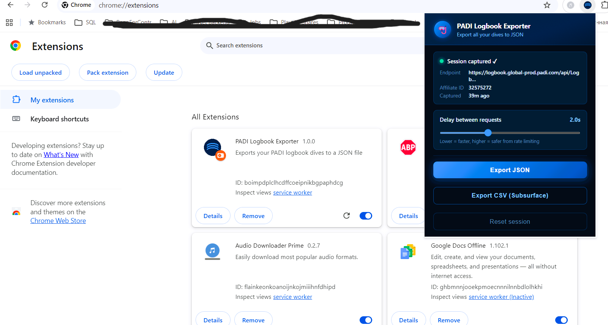

# PADI Logbook Exporter

A Chrome extension that exports your complete [PADI](https://app.padi.com) dive logbook to **JSON** or **CSV** format, with CSV ready to import directly into [Subsurface](https://subsurface-divelog.org).

## How it works

PADI's web app communicates with a GraphQL API. The extension intercepts outgoing requests to capture session credentials and `affiliate_id`, then uses them to:

1. Fetch the complete dive list
2. Fetch full details for each individual dive
3. Download everything as a single file

## Installation

1. Clone or download this repository
2. Open Chrome and go to `chrome://extensions`
3. Enable **Developer mode** (toggle in the top right)
4. Click **Load unpacked** and select the repository folder
5. The 🤿 icon will appear in your toolbar

## Screenshot

## Usage

1. Open [app.padi.com](https://app.padi.com) and log in
2. Navigate to your **Logbook** — this triggers auth capture
3. Click on any dive — this captures your `affiliate_id`
4. Click the 🤿 extension icon in the toolbar
5. Confirm the status shows **Session captured ✓**
6. Choose your export format:
   - **Export JSON** — full raw data from the PADI API
   - **Export CSV (Subsurface)** — ready to import directly into Subsurface

## Exported fields

Not all PADI fields are currently included in the export. The following fields are transferred:

| PADI field | JSON | CSV (Subsurface) |
|---|:---:|:---:|
| Dive date | ✓ | ✓ |
| Dive location | ✓ | ✓ |
| Dive title | ✓ | — |
| Log type / course | ✓ | — |
| Max depth | ✓ | ✓ |
| Bottom time | ✓ | ✓ |
| Time in | ✓ | ✓ (if available) |
| Air temperature | ✓ | ✓ |
| Water temperature | ✓ | ✓ |
| Water type / body of water | ✓ | — |
| Visibility | ✓ | — |
| Wave / current conditions | ✓ | — |
| Suit type | ✓ | ✓ |
| Weight | ✓ | ✓ |
| Cylinder size & type | ✓ | ✓ |
| Start / end pressure | ✓ | ✓ |
| Gas mixture (O2%) | ✓ | ✓ |
| Buddy | ✓ | ✓ |
| Dive center | ✓ | ✓ |
| Notes | ✓ | ✓ |
| Feeling / rating | ✓ | ✓ |

## Importing into Subsurface

`Import → Import Log Files → select the CSV file`

In the column mapping dialog use these settings:
- Field separator: **comma**
- Units: **metric**
- Date format: **YYYY-MM-DD**

**Note on dive numbers:** dives are numbered chronologically — oldest dive gets #1.

**Note on time:** PADI does not reliably store dive start time. If `time_in` is missing, the first dive of a day gets `00:00`, each subsequent dive on the same day gets `+2h` (i.e. `02:00`, `04:00`...) to avoid Subsurface treating them as duplicates.

**Note on ratings:** PADI's `feeling` field maps to Subsurface's 5-star rating:

| PADI | Subsurface |
|------|-----------|
| Amazing | ★★★★★ |
| Good | ★★★★ |
| Average | ★★★ |
| Poor | ★★ |

## Settings

**Delay between requests** — adjustable from 0.5s to 5.0s (default: 2s). Controls the pause between individual dive detail requests. Increase if you experience errors or rate limiting from the PADI API.

## Limitations

- **Not tested on large logbooks.** The extension has been developed and tested on a logbook of ~25 dives. Behavior on logbooks with hundreds of dives is unknown — longer delays and timeouts are more likely.
- **Not all PADI fields are exported to CSV.** See the field table above. Fields like visibility, current, water type and dive title are available in the JSON export only.
- **Dive start time is not stored by PADI** in most cases, so times in the CSV are approximated.
- **No dive profile data.** PADI does not expose depth profile samples via this API — only summary data (max depth, bottom time) is available.

## Privacy

All requests are made **directly from your browser** using your existing PADI session. No data is sent to any third-party server. Captured credentials are stored only in `chrome.storage.local` and can be cleared at any time via the **Reset session** button.

## Troubleshooting

| Problem | Solution |
|---------|----------|
| "No session captured" | Navigate to the Logbook page first, then open the popup |
| `affiliate_id` not captured | Click on any individual dive to trigger that request |
| Export fails with 401/403 | Session expired — reload PADI and navigate to the logbook again |
| Some dives have missing details | That dive's detail request failed; it will still appear with basic data |
| Subsurface shows fewer dives than expected | Two dives likely share the same date and time — this shouldn't happen with current time logic, but can be verified in the CSV |

## License

[MIT](LICENSE)
